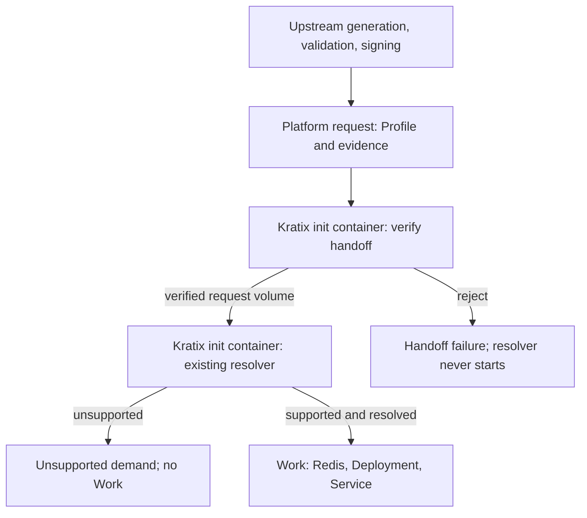

# Platform workflow: verify first, then resolve

This is the platform-automation presentation of the validated-profile-handoff
experiment. The existing Go verifier runs inside a Kratix Promise workflow,
before the existing Python ApplicationRelease resolver. The shell harness only
prepares fixtures, installs the platform, submits requests, and inspects results;
it does not invoke the workflow containers itself.



## Integration and trust boundary

`promise.py` derives an opt-in `validated-application-release` Promise from the
existing ApplicationRelease Promise. It leaves that original Promise, its
resolver, and the portable-profile workflow unchanged. The new platform request
kind is `ValidatedApplicationRelease`, **not a new Runtime Conditions resource**.
Render the inspectable manifest with:

```sh
python3 validated-profile-handoff/kratix/promise.py
```

The request retains the original `spec.profile` string and carries experimental
evidence in `spec.handoff`: the exact signed JSON string, a base64 signature, and
a map of extension digests to exact definition strings. This small in-request
transport avoids introducing an artifact registry. It is subject to Kubernetes
object-size limits and is not a general artifact-distribution design.

The first container (`verify-handoff`) checks the signature and exact-byte
digests using the existing `handoff.Verify`. It writes a JSON-encoded request
with the verified Profile into a dedicated `emptyDir`. JSON preserves the Profile
string when Python loads it as YAML. Only this verified request crosses to the
resolver; the evidence transport is stripped from the downstream request.

The second container mounts the verified volume **read-only**. A small wrapper
sets the existing resolver's input directory to that volume and refuses to run
without the verified request and successful gate metadata. There is no fallback
to `/kratix/input/object.yaml`. Its RC support tables, catalog checks, and resource
generation are unchanged. Neither container links the upstream RC validator.

`handoff-trust` is an operator-provisioned ConfigMap mounted only into the gate.
It contains a public key, not a secret. The harness keeps signing keys in a
temporary producer directory outside the artifact upload path and never sends
them to Kubernetes. Users who can replace trust configuration, change the
Promise/images, or administer the cluster are within the trusted platform
boundary. This is not isolation from cluster administrators.

These are **workflow Pod** init containers, not init containers on the workload's
Deployment. Kratix's ordered `spec.containers` become Kubernetes init containers;
see [Kratix internal objects](https://docs.kratix.io/main/platform-concepts/kratix-resources).

## Failure visibility

An init-container failure stops later containers, including Kratix's normal
status writer. Merely writing `/kratix/metadata/status.yaml` therefore cannot
publish a rejected handoff to resource status. Both adapters additionally write
small structured termination messages, which Kubernetes retains in
`status.initContainerStatuses[].state.terminated.message`, and structured logs.

Thus the assertion runner can distinguish `profile_digest_mismatch`,
`extension_mismatch`, `evidence_untrusted`, and a verified-but-`unsupported`
demand, without requiring the resolver or status writer to run after rejection.
Successful runs also preserve the handoff result in the resource's custom status.
The Promise uses `restartPolicy: Never` and `backoffLimit: 0` so each deliberate
rejection terminates promptly rather than becoming a retry loop.

## Run and inspect

Prerequisites: Docker, Go 1.25+, Python with PyYAML, kubectl, KinD, and the sibling
profiler/extensions checkouts at the revisions recorded in the parent README.
From the repository root:

```sh
# Fast process-level tests with real upstream validation and the existing resolver:
python3 -m unittest discover -s validated-profile-handoff/kratix -p 'test_*.py' -v

# Full platform demonstration on a dedicated disposable cluster:
validated-profile-handoff/scripts/kind-ci.sh
```

The harness refuses to reuse an existing `validated-profile-handoff` cluster or
an existing `generated/kratix` output directory. It uses a private kubeconfig,
never the operator's current context, and deletes only its dedicated cluster
after collecting diagnostics. Use a fresh checkout for a subsequent run.

The GitHub Actions workflow has separate fast-test and **Real Kratix workflow on
KinD** jobs. It uses the repository's existing quick-start installer (which tracks
`latest`, overridable through `KRATIX_INSTALLER_URL`); the diagnostic Pod specs
record the actual images used. This bootstrap is a demo environment, not a
production installation or a fully pinned supply chain.

| Request | Real-cluster assertion |
| --- | --- |
| Valid | Gate exits 0; resolver exits 0; Work contains Redis, Deployment, Service and expected environment bindings |
| Changed Profile | Gate reports digest mismatch; resolver never starts; no Work |
| Changed extension | Gate reports extension mismatch; resolver never starts; no Work |
| Untrusted signer | Gate reports untrusted evidence; resolver never starts; no Work |
| Valid memcached demand | Gate exits 0; resolver runs and reports unsupported; no Work |

Assertions inspect every workflow Pod attempt and verify actual init-container
ordering. The `kratix-handoff-workflow-evidence` CI artifact retains the generated
Promise, public bundles/requests, Pod and Job status, container logs, resource
status, Work, and decoded emitted manifests, including diagnostics on failure.
No private keys, Secrets, or kubeconfig are uploaded.

Local process-level tests are not evidence that the cluster job passed: inspect
the separate CI job and retained artifacts for that result. The cluster test
asserts platform resource generation, not downstream application readiness,
production scale, or production signing infrastructure. Failures should be fixed
with follow-up commits, preserving the run and commit history.
